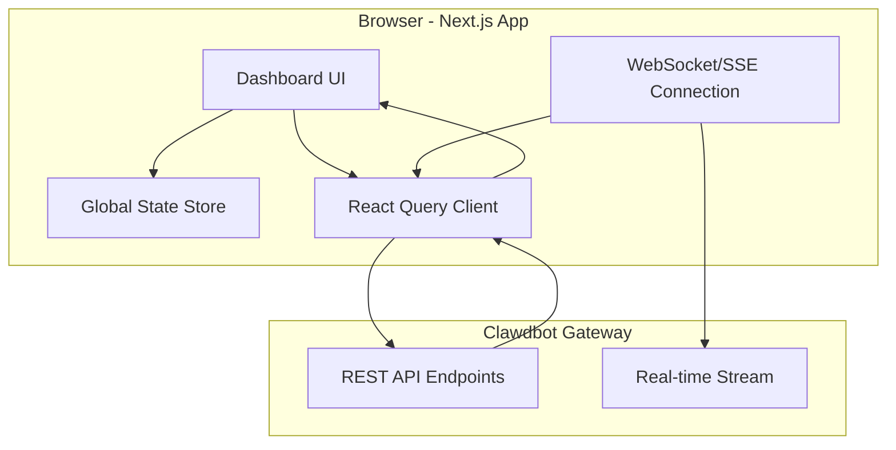
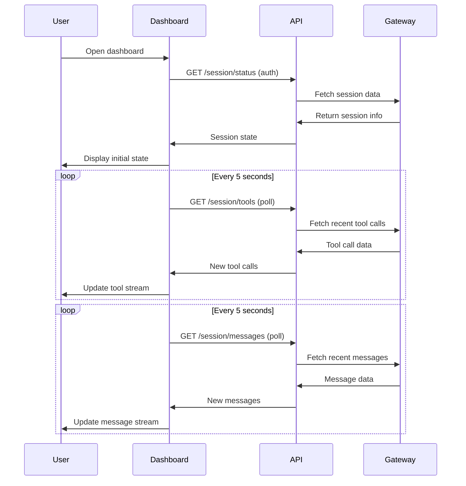

# Design: Clawdbot Web Dashboard

## Overview

The dashboard will be built as a modern Next.js 14 application using TypeScript, Tailwind CSS, and shadcn/ui components. It will communicate with the Clawdbot Gateway API to fetch session data, tool calls, messages, and reasoning in near real-time. The architecture follows a component-based design with separate sections for each data stream, using React Query for data fetching and optimistic updates for a responsive user experience.

## Architecture

### Component Diagram



### Components

#### DashboardLayout
**Purpose**: Main layout shell with navigation and theme toggle
**Responsibilities**:
- Manage global theme (light/dark)
- Provide responsive container structure
- Handle loading states across all components

#### SessionHeader
**Purpose**: Display current session information and connection status
**Responsibilities**:
- Show session ID, creation time, model info
- Display connection status indicator (connected/disconnected)
- Update session state on polling

#### ToolCallStream
**Purpose**: Display real-time stream of tool executions
**Responsibilities**:
- Render tool calls in chronological order
- Color-code status (running, success, error)
- Expandable details for parameters/results
- Filter by tool name or status

#### MessageStream
**Purpose**: Display conversation history between user and assistant
**Responsibilities**:
- Render messages with markdown support
- Distinguish user vs. assistant messages
- Auto-scroll to latest message
- Implement pagination for long conversations

#### ReasoningPanel
**Purpose**: Show internal reasoning process when available
**Responsibilities**:
- Display reasoning tokens/content
- Collapsible UI to save space
- Update in near real-time
- Render with appropriate formatting

#### TaskTracker
**Purpose**: Track active and completed tasks
**Responsibilities**:
- Display task list with status indicators
- Show task priorities and descriptions
- Filter by task status
- Visual progress indicators

#### ApiClient
**Purpose**: Abstraction layer for Gateway API communication
**Responsibilities**:
- Fetch session data, tool calls, messages
- Handle authentication (API keys)
- Implement polling for real-time updates
- Error handling and retry logic

### Data Flow



1. Dashboard loads and authenticates with Gateway API
2. Fetches initial session state (status, model, runtime info)
3. Begins polling for tool calls and messages every 5 seconds
4. Updates UI incrementally with new data
5. Handles connection failures with retry logic

## Technical Decisions

| Decision | Options Considered | Choice | Rationale |
|----------|-------------------|--------|-----------|
| Frontend Framework | Next.js 14, React + Vite, SvelteKit | Next.js 14 | Built-in API routes, SSR, excellent TypeScript support |
| UI Library | shadcn/ui, MUI, Chakra UI | shadcn/ui | Modern, customizable, accessible, based on Radix UI |
| Styling | Tailwind CSS, CSS Modules, Styled Components | Tailwind CSS | Utility-first, great DX, consistent with modern React |
| State Management | Zustand, Redux, React Context | Zustand | Simple, minimal boilerplate, great for client state |
| Data Fetching | React Query, SWR, custom hooks | React Query | Excellent caching, deduping, optimistic updates |
| Real-time Updates | WebSocket, SSE, Polling | Polling (v1) | Simpler, works with existing Gateway API; upgrade to WS later |
| Authentication | API Key, OAuth, JWT | API Key (v1) | Simplest for MVP; upgrade to OAuth later |
| Deployment | Coolify, Vercel, AWS | Coolify | Already integrated with infrastructure |

## File Structure

| File | Action | Purpose |
|------|--------|---------|
| src/app/page.tsx | Create | Main dashboard page |
| src/app/layout.tsx | Create | Root layout with theme provider |
| src/components/DashboardLayout.tsx | Create | Main layout shell |
| src/components/SessionHeader.tsx | Create | Session info display |
| src/components/ToolCallStream.tsx | Create | Tool call stream display |
| src/components/MessageStream.tsx | Create | Message history display |
| src/components/ReasoningPanel.tsx | Create | Reasoning process display |
| src/components/TaskTracker.tsx | Create | Task status tracker |
| src/lib/apiClient.ts | Create | Gateway API abstraction |
| src/lib/types.ts | Create | TypeScript type definitions |
| src/lib/store.ts | Create | Zustand global state store |
| tailwind.config.ts | Create | Tailwind configuration |
| components.json | Create | shadcn/ui configuration |
| package.json | Create | Dependencies and scripts |
| tsconfig.json | Create | TypeScript configuration |
| next.config.ts | Create | Next.js configuration |
| README.md | Create | Setup and deployment documentation |

## Interfaces

```typescript
// Gateway API types
interface SessionStatus {
  sessionId: string;
  createdAt: string;
  model: string;
  status: 'running' | 'idle' | 'processing';
  runtime: {
    host: string;
    os: string;
    nodeVersion: string;
  };
}

interface ToolCall {
  id: string;
  timestamp: string;
  tool: string;
  status: 'running' | 'success' | 'error';
  parameters?: Record<string, any>;
  result?: any;
  error?: string;
}

interface Message {
  id: string;
  timestamp: string;
  role: 'user' | 'assistant';
  content: string;
  reasoning?: string;
}

interface Task {
  id: string;
  description: string;
  status: 'pending' | 'in-progress' | 'complete';
  priority?: number;
  completedAt?: string;
}

// API Client interface
interface ApiClient {
  getSessionStatus(): Promise<SessionStatus>;
  getToolCalls(after?: string): Promise<ToolCall[]>;
  getMessages(after?: string, limit?: number): Promise<Message[]>;
  getTasks(): Promise<Task[]>;
}

// Component props interfaces
interface ToolCallStreamProps {
  toolCalls: ToolCall[];
  filter?: string;
  statusFilter?: 'running' | 'success' | 'error' | 'all';
}

interface MessageStreamProps {
  messages: Message[];
  autoScroll?: boolean;
}
```

## Error Handling

| Error Scenario | Handling Strategy | User Impact |
|----------------|-------------------|-------------|
| API unreachable | Retry with exponential backoff (3 attempts), show error toast | User sees connection status indicator |
| Authentication failed | Redirect to login or prompt for API key | User prompted to provide credentials |
| Rate limited | Pause polling for 60s, show warning toast | Temporary pause in updates |
| Invalid data | Log error, skip corrupted entries, show warning | Some data may be missing |
| WebSocket disconnect | Fall back to polling, show status indicator | Updates continue with polling |

## Edge Cases

- **Empty session**: Show empty state message with helpful tips
- **Long tool parameter lists**: Truncate display, show "View Details" button
- **Very long messages**: Truncate preview, expand on click
- **Rapid tool calls**: Batch updates in 100ms windows to avoid UI thrashing
- **Large message history (>1000 messages)**: Implement pagination, show oldest first
- **Concurrent tool calls**: Display in chronological order, running tools show last
- **Reasoning not available**: Hide reasoning panel when no reasoning data

## Dependencies

| Package | Version | Purpose |
|---------|---------|---------|
| next | 14.2.0 | React framework |
| react | 18.3.0 | UI library |
| typescript | 5.4.0 | Type safety |
| @tanstack/react-query | 5.28.0 | Data fetching and caching |
| zustand | 4.5.0 | State management |
| tailwindcss | 3.4.0 | Styling |
| @radix-ui/react-* | latest | shadcn/ui primitives |
| lucide-react | 0.359.0 | Icon library |
| clsx | 2.1.0 | Utility for conditional classes |
| tailwind-merge | 2.2.0 | Merge tailwind classes |

## Security Considerations

- **API Key Storage**: Store API keys in environment variables, never in client code
- **CORS**: Configure Gateway API to allow dashboard domain
- **XSS Prevention**: Sanitize all user-generated content (markdown rendering)
- **Authentication**: Require valid API key for all API calls
- **Rate Limiting**: Implement client-side rate limiting to avoid overwhelming Gateway
- **HTTPS**: Use HTTPS for all API calls in production

## Performance Considerations

- **Virtual Scrolling**: Use react-window for long message/tool lists
- **Debouncing**: Batch rapid updates in 100ms windows
- **Pagination**: Limit message history to 50 per page
- **Data Pruning**: Clear old tool calls after 500 entries
- **Code Splitting**: Lazy load components using React.lazy()
- **Memoization**: Use React.memo for expensive components
- **Optimistic Updates**: Update UI immediately, sync with API later

## Test Strategy

### Unit Tests
- Test API client methods with mocked responses
- Test component rendering with props
- Test state store updates
- Mock requirements: Mock Gateway API responses, mock WebSocket events

### Integration Tests
- Test API client + React Query integration
- Test error handling flows (network errors, auth failures)
- Test polling behavior with real Gateway API

### E2E Tests
- Test full user flow: load dashboard → view session → watch updates → filter tools
- Test authentication flow
- Test error states (disconnect, rate limit)
- Test responsive design on mobile viewport

## Existing Patterns to Follow

Based on codebase analysis:
- **Terry's Eagles HQ** (`/home/opc/clawd/terry-eagles-site/`): Next.js 14 + shadcn/ui pattern
- **Coolify integration** (`skills/coolify/`): Docker deployment pattern
- **Script conventions** (`scripts/`): Use Python for utilities, Node.js for web apps
- **Documentation style** (`*.md` files): Clear, structured markdown with sections
